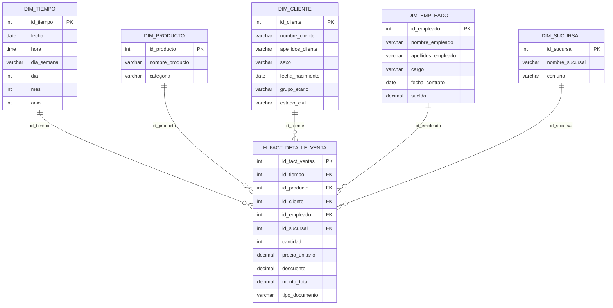

```mermaid
erDiagram
    DIM_TIEMPO ||--o{ H_FACT_DETALLE_VENTA : "id_tiempo"
    DIM_PRODUCTO ||--o{ H_FACT_DETALLE_VENTA : "id_producto"
    DIM_CLIENTE ||--o{ H_FACT_DETALLE_VENTA : "id_cliente"
    DIM_EMPLEADO ||--o{ H_FACT_DETALLE_VENTA : "id_empleado"
    DIM_SUCURSAL ||--o{ H_FACT_DETALLE_VENTA : "id_sucursal"

    H_FACT_DETALLE_VENTA {
        int id_fact_ventas PK
        int id_tiempo FK
        int id_producto FK
        int id_cliente FK
        int id_empleado FK
        int id_sucursal FK
        int cantidad
        decimal precio_unitario
        decimal descuento
        decimal monto_total
        varchar tipo_documento
    }

    DIM_TIEMPO {
        int id_tiempo PK
        date fecha
        time hora
        varchar dia_semana
        int dia
        int mes
        int anio
    }

    DIM_PRODUCTO {
        int id_producto PK
        varchar nombre_producto
        varchar categoria
    }

    DIM_EMPLEADO {
        int id_empleado PK
        varchar nombre_empleado
        varchar apellidos_empleado
        varchar cargo
        date fecha_contrato
        decimal sueldo
    }

    DIM_CLIENTE {
        int id_cliente PK
        varchar nombre_cliente
        varchar apellidos_cliente
        varchar sexo
        date fecha_nacimiento
        varchar grupo_etario
        varchar estado_civil
    }

    DIM_SUCURSAL {
        int id_sucursal PK
        varchar nombre_sucursal
        varchar comuna
    }
```
