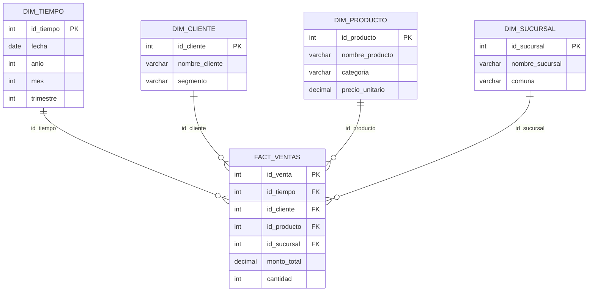

```mermaid
erDiagram
    DIM_TIEMPO ||--o{ FACT_VENTAS : "id_tiempo"
    DIM_CLIENTE ||--o{ FACT_VENTAS : "id_cliente"
    DIM_PRODUCTO ||--o{ FACT_VENTAS : "id_producto"
    DIM_SUCURSAL ||--o{ FACT_VENTAS : "id_sucursal"

    FACT_VENTAS {
        int id_venta PK
        int id_tiempo FK
        int id_cliente FK
        int id_producto FK
        int id_sucursal FK
        decimal monto_total
        int cantidad
    }

    DIM_PRODUCTO {
        int id_producto PK
        varchar nombre_producto
        varchar categoria
        decimal precio_unitario
    }

    DIM_CLIENTE {
        int id_cliente PK
        varchar nombre_cliente
        varchar segmento
    }

    DIM_TIEMPO {
        int id_tiempo PK
        date fecha
        int anio
        int mes
        int trimestre
    }

    DIM_SUCURSAL {
        int id_sucursal PK
        varchar nombre_sucursal
        varchar comuna
    }
```
